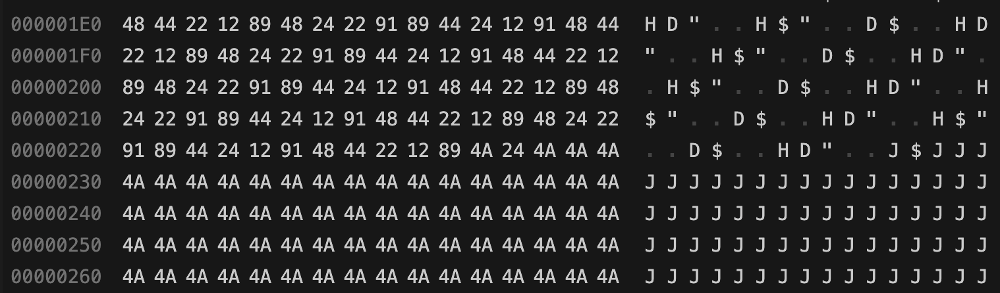
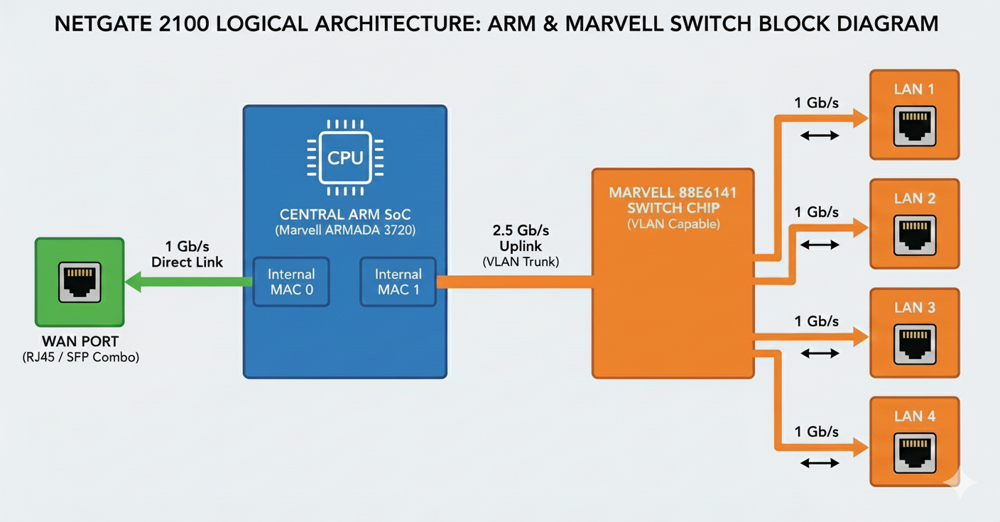
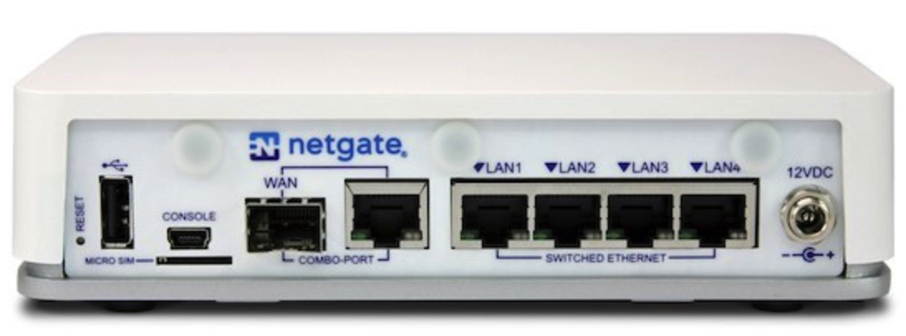
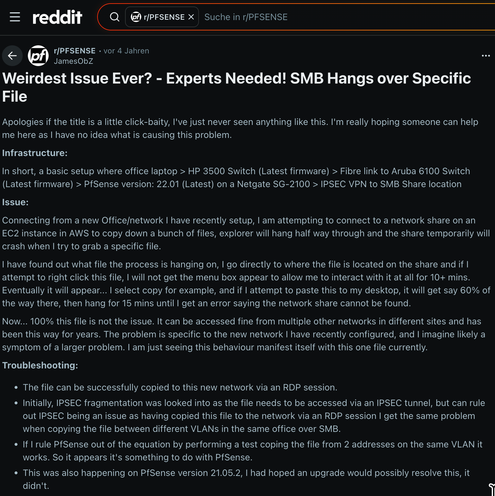

<!-- _class: title -->
# #toxicframe

## Der mysteriöse Hardware-Bug

**der Dateitransfers bei genau 49% stoppen lässt**

*Netgate SG-2100 / Marvell 6000*

<br>
<br>

<div class="right">Wim Bonis · Stylite AG · 39C3 Lightning Talk</div>

---
<!-- do page numbers for this slide and the next ones -->
<!-- _paginate: hold -->
<!-- paginate: true -->
# Der Kundenfall

## 🚨 Problem: Dateitransfer stoppt **immer** bei 49%

**Situation:**
- SMB-Dateiübertragung über **IPsec VPN**
- Ziel: Samba-Server im Firmennetzwerk
- **Neue Hardware:** Netgate SG-2100 (pfSense)

**Symptom:** 100% reproduzierbarer Abbruch bei exakt 49% einer bestimmten Datei. (stdww2.cab = 195MB)

---

# Erste Diagnose

## ❌ Was alles **NICHT** die Ursache war:

- **Netzwerk-Konfiguration:** MTU/MSS/Fragmentierung
- **VPN-Protokolle:** IPsec ↔ OpenVPN
- **Security:** Virenscanner / DPI
- **Hardware-Offloading:** Checksum, TSO, LSO

## 🎯 Fazit: **NICHT** VPN/SMB - etwas viel Tieferes!

---

# Paketanalyse

<div class="media-right"></div>

## 🔍 Durchbruch: Das Problem isoliert!

- Abbruch bei 49% auf **einen einzigen 1-KB-Block** eingrenzbar
- Aus Originaldatei `stdww2.cab` bei 49% isoliert
- **"Toxisches Paket"** identifiziert!

**Reproduktion:**
```bash
dd if=stdww2.cab bs=1024 skip=99989 count=1 of=toxic.bin
```

<div class="clear"></div>

---

# Labor-Analyse

## 🧪 Protokoll-unabhängiger Hardware-Bug, nicht nur SMB, auch HTTP

| Protokoll/Testpfad | Ergebnis |
| --- | --- |
| **Reines Forwarding** (LAN↔Switch) | ❌ Abbruch |
| **SMB** (Dateitransfer) | ❌ Abbruch |
| **HTTP** (Web-Download) | ❌ Abbruch |

## 🎯 Schlussfolgerung: **Hardware/Switch-Pfad** betroffen!

**Einfachster Test: Download der toxische Datei:**
```bash
# nur über HTTP , den über HTTPS werden andere Daten übertragen
curl http://toxicframe.stylite-live.net/toxic.bin
```

---

# Hardware-Architektur

<div class="media-right"></div>

## 🖥️ Netgate SG-2100 Aufbau:

- **CPU:** Marvell Armada 3720 (ARM64 Cortex-A53)
- **Switch:** Interner Marvell 6000 Switch (88E6141)
- **Uplink:** CPU ↔ Switch mit **2.5 GbE**

## 🔍 Muster erkannt:
*Sobald der Switch-Pfad beteiligt ist, ist der Bug 100% reproduzierbar!*

<div class="clear"></div>

---

# TCP Dump

## 🔎 Das Paket verschwindet im Switch!

**Netzwerk-Trace Ergebnis:**

- **Netgate → Switch:** ✅ Paket wird **gesendet**
- **Switch → Client:** ❌ Paket kommt **nie an**

## 🚨 Das "toxische" Paket verschwindet **im Switch-Pfad**!

*(Paket-Filter, Switch-ASIC oder elektrischer Pfad CPU↔Switch)*

---


# Historie

<div class="media-right"></div>

## 📅 Das Problem ist **NICHT NEU**!

- **Mindestens seit 2020** bekannt
- **Reddit-Thread:** "Weirdest Issue Ever?" - exakt gleiche Symptome

## 😱 Damals auch ohne Lösung.

---

# Hersteller-Kontakt

## 📞 Netgate informiert: 
- **am** 3.11.2025
- **Bug bestätigt** und reproduzierbar
- **Status:** Anerkannt, aber...
- **Kein klarer Fix** bisher verfügbar
- **Kein Rollout** eines Patches

## 🤔 Was passiert als nächstes?

---


# Das Paketmuster:

## 🎯 Minimal reproduzierbar:

**Trigger-File:** `toxic.bin` (nur 1 KB!)
**Quelle:** Aus `stdww2.cab` isoliert

```bash
dd if=stdww2.cab bs=1024 skip=99989 count=1 of=toxic.bin
```

## 📊 Enthält wahrscheinlich:
- 14-Byte Pattern wiederholt sich 39-mal: 44 24 12 91 48 44 22 12 89 48 24 22 91 89
- Spezifisches Timing oder Bit-Muster

---

# Alternative Hardware

## 🧪 Test mit ähnlicher Hardware:

**GL-iNet Edge GL-MV1000 Brume:**
- Marvell 88E6141 Switch (gleicher Chip!)
- **Unterschied:** Nur 1GbE statt 2.5GbE Uplink
- **OpenWRT** statt pfSense
- **Ergebnis:** toxicframe → **nicht reproduzierbar** ✅

## 🎯 Hypothese: 2.5GbE Uplink könnte der Auslöser sein!

---

# Folgerungen ?

## ⚠️ Status: Alles noch **Vermutung**

- **Hardware-Bug** - nicht wegkonfigurierbar!
- **Hersteller-Fix** nötig: Firmware/ASIC/Hardware-Revision
- **4+ Jahre** bekannt (Reddit 2020)

## 🛠️ Workaround:
**Nicht den integrierten Switch verwenden!**
- Nur WAN-Port verwenden
- VLANs mit externem Switch realisieren

---

# Diskussion & Hilfe

<div class="media-right"></div>

## 🤝 Wo bin ich?
Ihr findet mich beim OpenWRT Tisch in Halle H

**Habt ihr SG-2100 oder ähnliche Hardware?**

**Ideen für weitere Analyse:**
- Kann man aus dem Switch-ASIC herauslesen, ob das Paket gedroppt wird?
- Bekommt man OpenWRT o.ä. auf die SG-2100 installiert?

## 🔗 Ressourcen:

- **Artikel:** https://stylite.io/toxic
